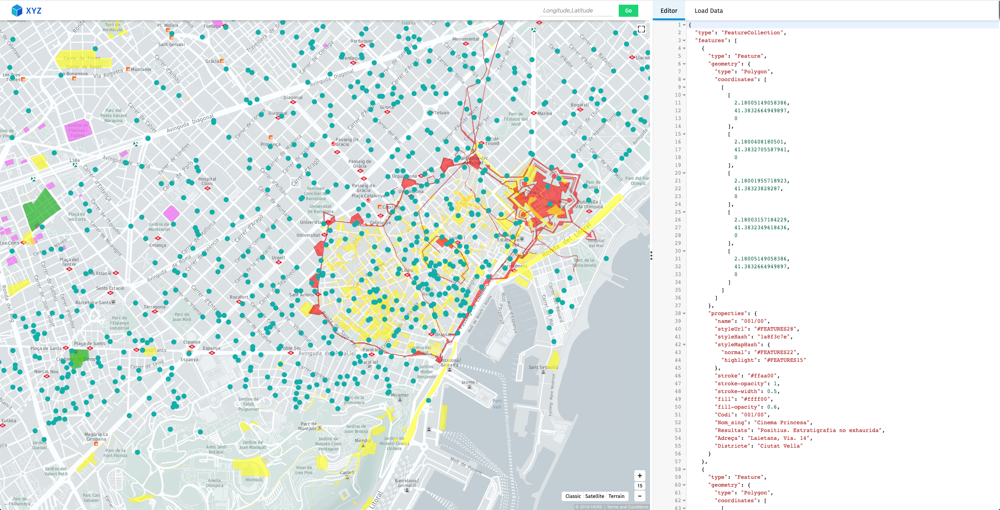

# GeoJSON Tool

A web based visualization tool for GeoJSON data.

### [GeoJSON.tools site](http://geojson.tools)

## Overview

The GeoJSON Tool is a web based visualization tool for GeoJSON data that can quickly display data from a various sources, highlight and inspect specific features and supports even complex operations like finding data based on content.




## Getting Started

### [Getting Started Guide](https://www.here.xyz/viewer-tool/)

Also below is the list of feature available with this tool:  

-   Drag and drop multiple GeoJSON file on map to render and load editor with data.
-   Directly jump to particular location on first load: https://geojson.tools/?map=-74.0146844,40.7053532,15
-   Upload multiple GeoJSON file to render and load editor with data.
-   Use multiple GeoJSON file URL to render and load editor with data.
-   Use GeoJSON editor to render feature on map.
-   Share tool's URL with GeoJSON url in params.
-   On selecting lat-long in editor map with that point get centered.
-   On selecting feature object in editor, map with that feature will be highlighted.
-   On click of any feature its property will be visible and corresponding lat-long will be focused in editor.
-   Highlight features with matching properties by clicking on property label in feature explorer pop-up card.
-   Map only view option from UI as well as URL parameters.
-   Displaying feature colors if available in property object of feature.
-   Visualize your XYZ space data directly from URL using `spaceId` and `access_token` (https://geojson.tools/?space=Opxf79Cn&access_token=EQvJESGWqtBGYkGBgRHMZw)
-   If GeoJSON properties object contains `heading_drg` or `vehicBearing` then it renders point as arrow image with provided bearing.
-   If GeoJSON properties object contains `marker-url` then it renders image from given url instead of point on map.
-   If GeoJSON properties object contains `marker-text` then it display given text instead of point on map.

## Development

Install node and project dependencies:

```
npm install
```

Run a local server with:

```
export APIKEY=HereApiKey && npm start
```

An App will be served at http://localhost:3000

Note: You can generate your APIKEY at http://developer.here.com


## Versioning

We use [SemVer](http://semver.org/) for versioning. For the versions available, see the [tags on this repository](https://github.com/heremaps/geojson-tool/tags).


## License

Copyright (C) 2019 HERE Europe B.V.

See the [LICENSE](./LICENSE) file in the root of this project for license details.
